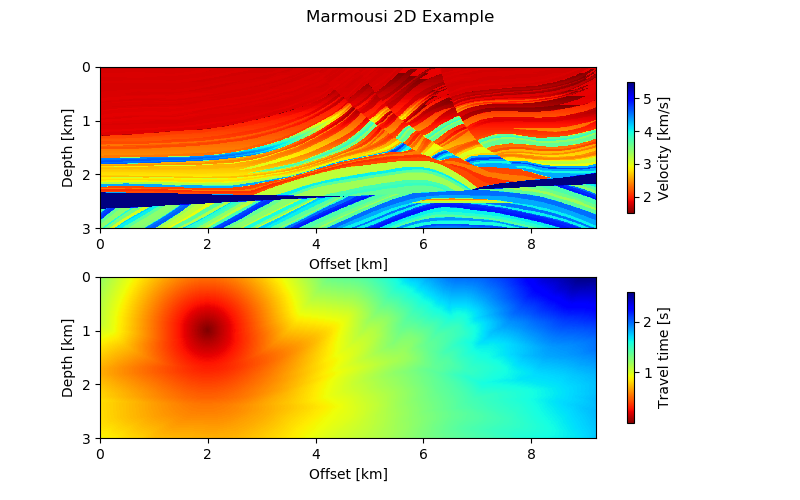
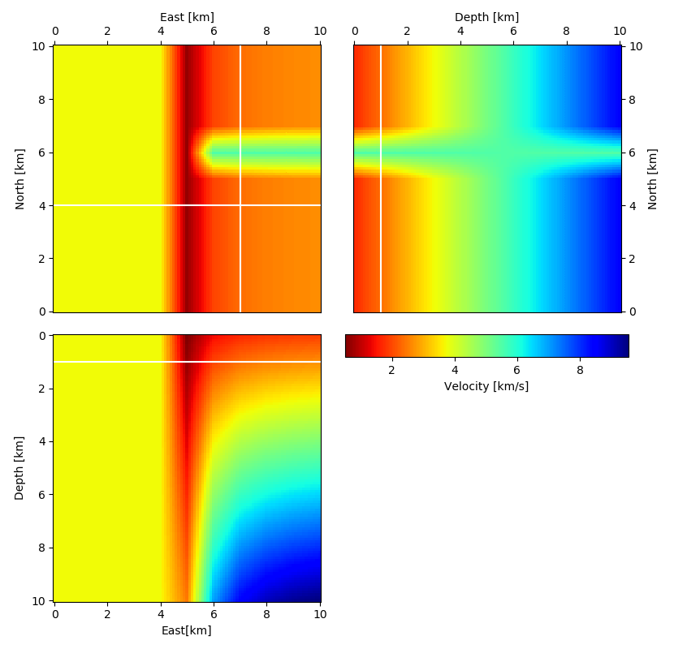
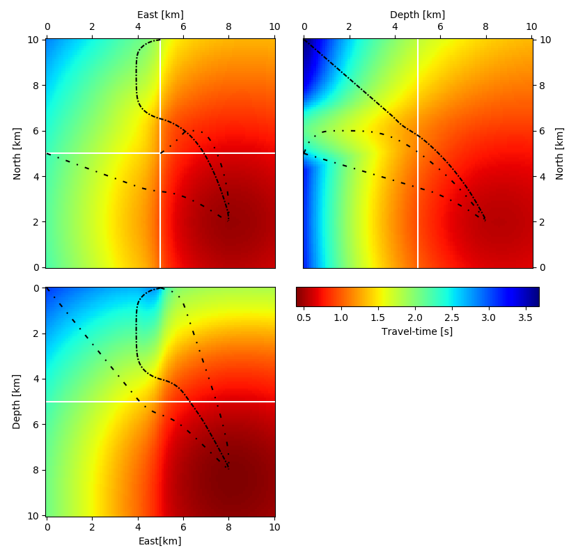

# Welcome to the *pykonal* repository!
This code implements a mixed- (first- and second-) order finite-difference solver for the 3D Eikonal equation in Cartesian coordinates using the Fast-Marching Method of Sethian et al. (1996).


## Planned development
1. Implement in spherical coordinates


## Installation
```bash
sh$> pip install .
```

## Gallery

### Compute synthetic travel times in 2D


### And 3D



### And trace rays



## References
Sethian, J. A. (1996). A fast marching level set method for monotonically advancing fronts. Proceedings of the National Academy of Sciences, 93(4), 1591–1595. https://doi.org/10.1073/pnas.93.4.1591
