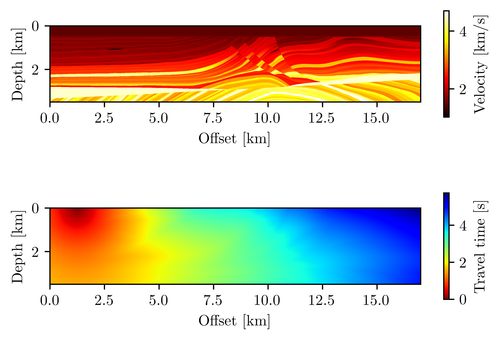
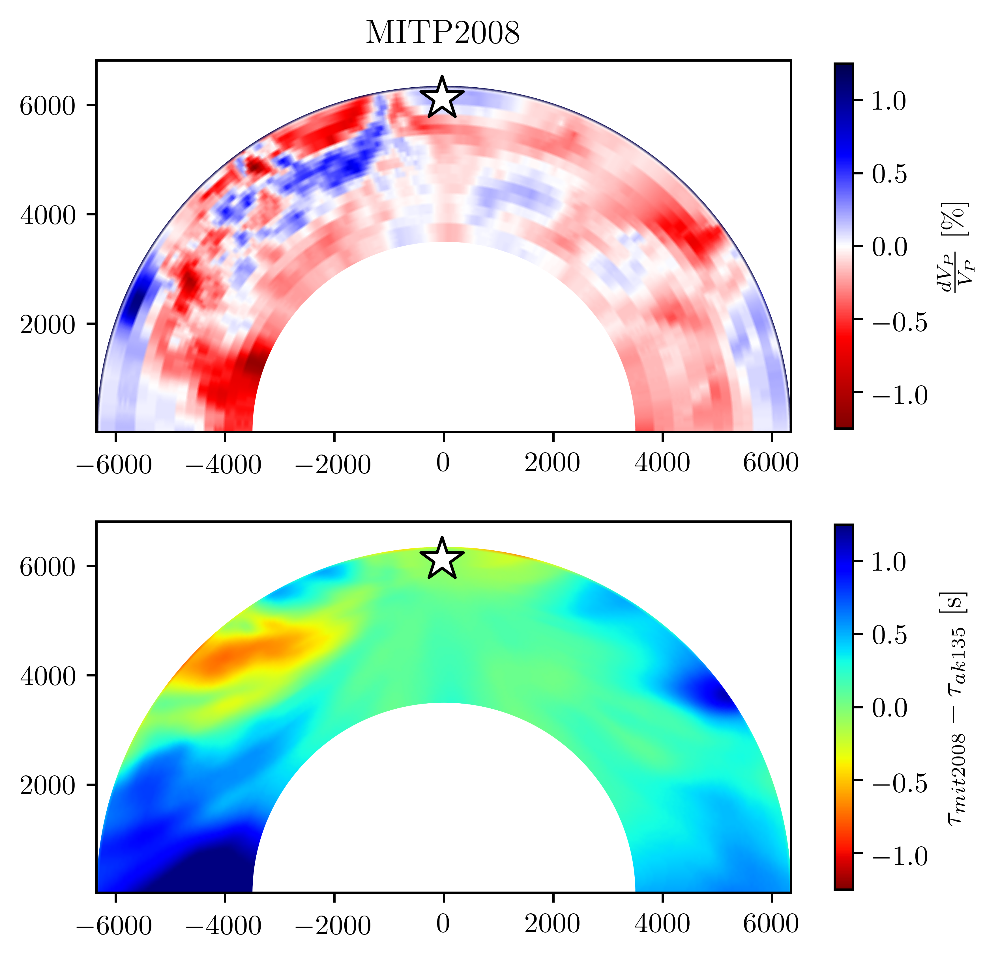
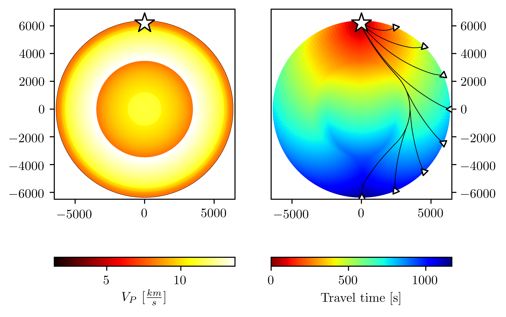
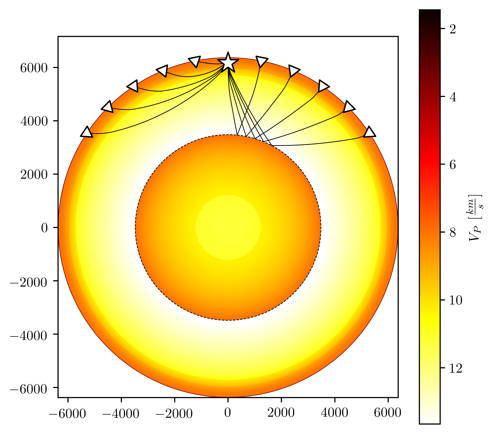

# Welcome to the *pykonal* repository!
This code implements a mixed- (first- and second-) order finite-difference solver for the 3D Eikonal equation in Cartesian and spherical coordinates using the Fast-Marching Method of Sethian et al. (1996).  
    
If you make use of this code in published work, please consider citing White et al. (2019).

## Installation
```bash
sh$> pip install .
```

## Gallery

### Marmousi2 velocity model
 

### MITP2008 velocity model


### Tracing rays through AK135 velocity model
  

### Tracing core-mantle boundary reflections



## References
Sethian, J. A. (1996). A fast marching level set method for monotonically advancing fronts. *Proceedings of the National Academy of Sciences, 93*(4), 1591–1595. https://doi.org/10.1073/pnas.93.4.1591  

White, M. C. A., Fang, H., Nakata, N., & Ben-Zion, Y. (2019). PyKonal: A Python package for solving the Eikonal equation in spherical and Cartesian coordinates using the Fast Marching Method. *Seismological Research Letters, in review*.
