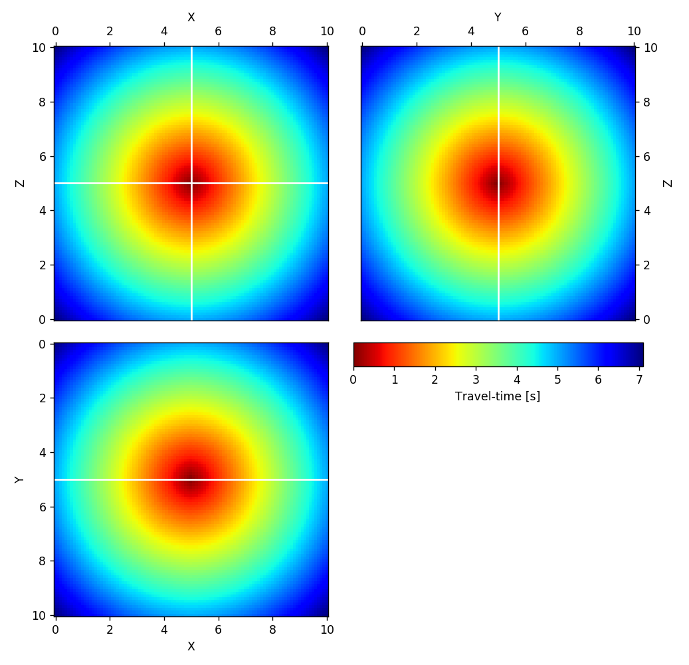
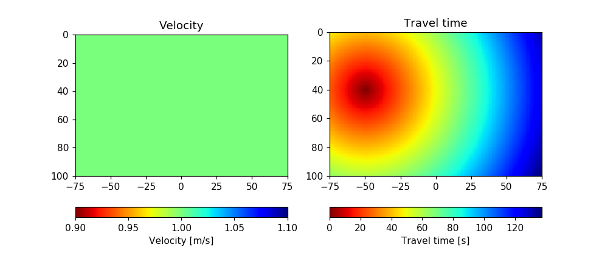
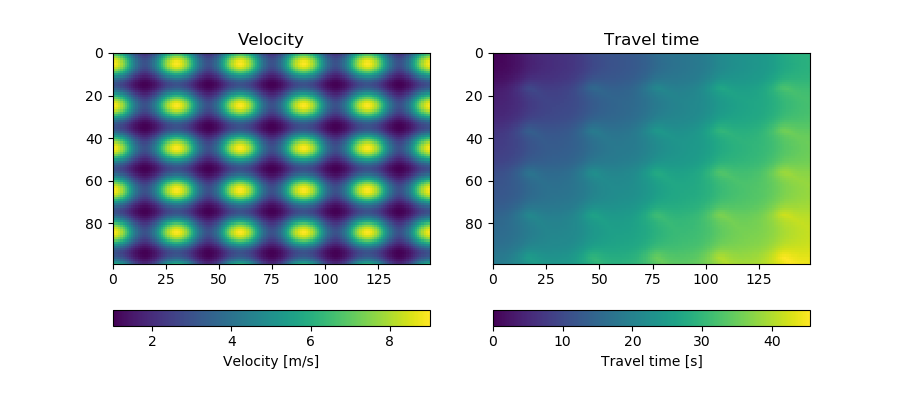

# Welcome to the *pykonal* repository!
This code implements a first-order finite-difference solver for the 2D Eikonal equation in Cartesian coordinates using the Fast-Marching Method of Sethian et al. (1996).

## Planned development
1. Implement second-order update scheme
2. Extend to 3D
3. Implement in spherical coordinates

## Example results

## References
Sethian, J. A. (1996). A fast marching level set method for monotonically advancing fronts. Proceedings of the National Academy of Sciences, 93(4), 1591–1595. https://doi.org/10.1073/pnas.93.4.1591