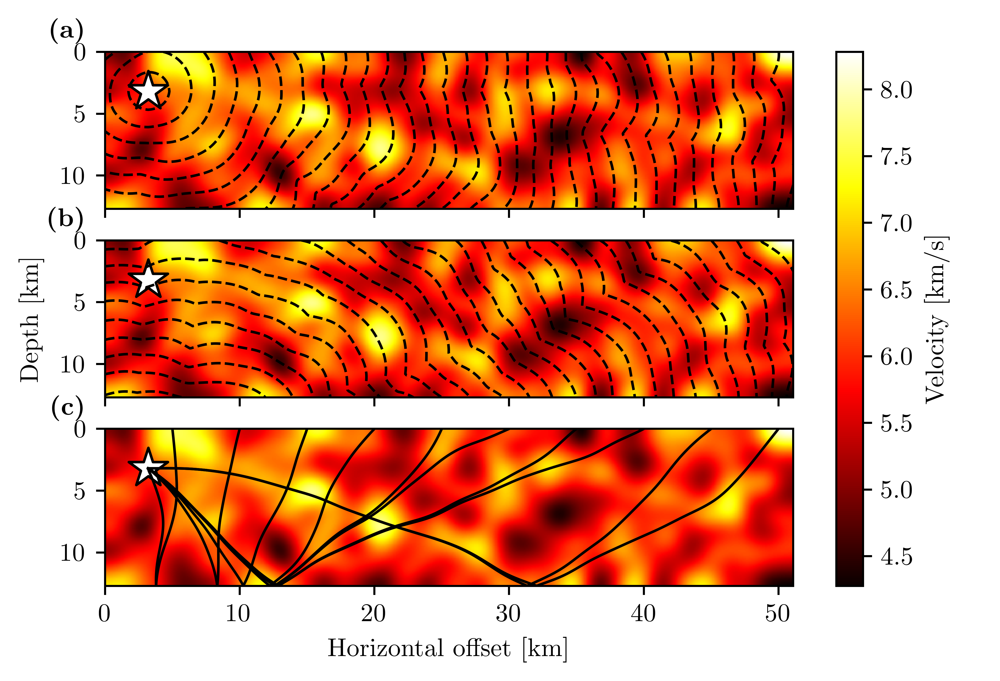

# Welcome to the *pykonal* repository!

This code implements the Fast Marching Method (FMM; Sethian *et al.*, 1996) for solving the eikonal equation in Cartesian or spherical coordinates in 2 or 3 dimensions. The method implements mixed first- and second-order finite differences.

PyKonal offers two features that are absent from the comparable [scikit-fmm](https://pythonhosted.org/scikit-fmm/ "sckit-fmm documentation") package: (a) an implementation in spherical coordinates, and (b) functionality to compute shortest-traveltime paths.

## Documentation
Documentation is available [here](https://malcolmw.github.io/pykonal-docs/ "PyKonal documentation").
    
## Citation
If you make use of this code in published work, please cite White *et al.* (2020).

## Installation
Download the [latest release](https://github.com/malcolmw/pykonal/releases "Releases").

### Conda—recommended
```bash
sh$> conda create --name pykonal -c conda-forge python=3.8 'cython>=0.29.14' h5py numpy scipy
sh$> conda activate pykonal
(pykonal)sh$> cd path/to/pykonal
(pykonal)sh$> pip install .
```
### PIP
```bash
sh$> pip install cython>=0.29.14 h5py numpy scipy
sh$> cd path/to/pykonal
sh$> pip install .
```
## Bugs
Please report bugs, feature requests, and questions through the [Issues](https://github.com/malcolmw/pykonal/issues "PyKonal Issues tracker") tracker.

## References
1. Sethian, J. A. (1996). A fast marching level set method for monotonically advancing fronts. *Proceedings of the National Academy of Sciences, 93*(4), 1591–1595. https://doi.org/10.1073/pnas.93.4.1591
2. White, M. C. A., Fang, H., Nakata, N., & Ben-Zion, Y. (2020). PyKonal: A Python Package for Solving the Eikonal Equation in Spherical and Cartesian Coordinates Using the Fast Marching Method. *Seismological Research Letters, 91*(4), 2378-2389. https://doi.org/10.1785/0220190318


